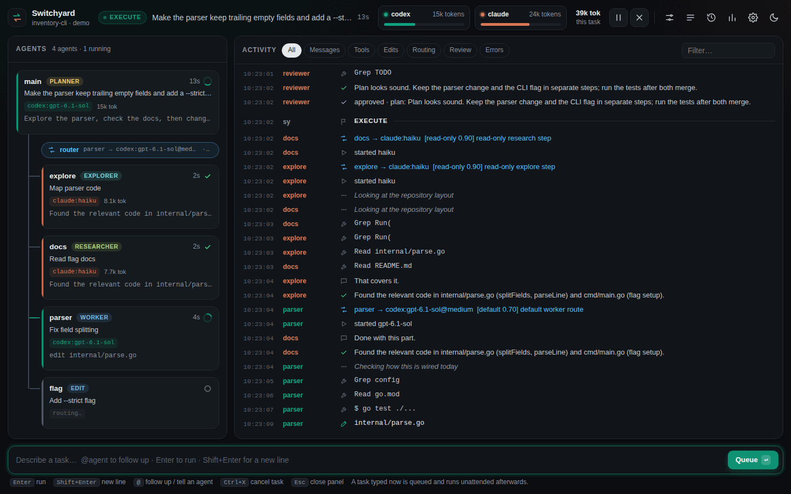
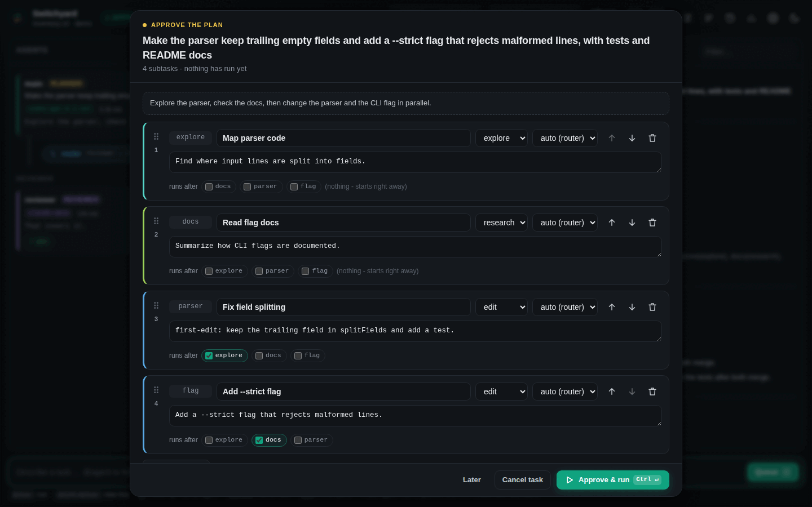
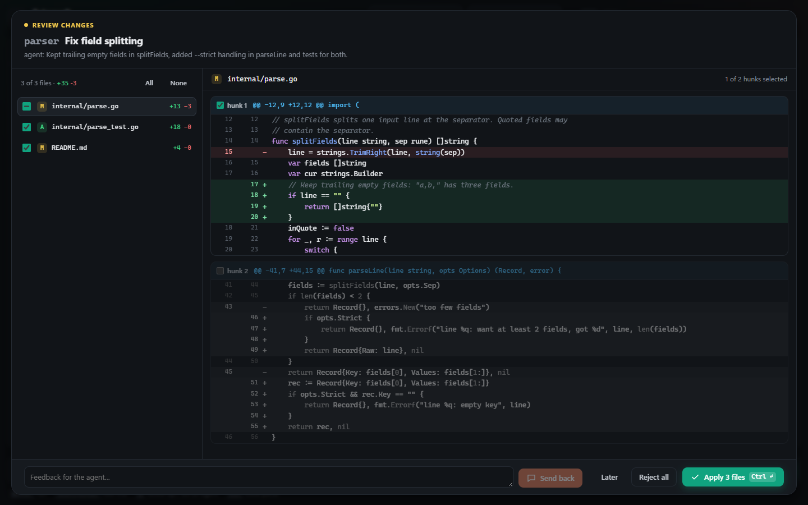

# Switchyard

A Windows-first, animated terminal app that routes coding work between your **ChatGPT (Codex CLI)** and **Claude (Claude Code)** subscriptions, and optionally **Gemini CLI**, **Qwen Code**, **DeepSeek** and **local models** ([more providers](docs/providers.md)). It picks a model for each step, runs agents in parallel and only calls the expensive models when it matters.

```
sy            # start the TUI in your project
sy web        # the same engine in your browser (sy app: in its own window)
sy --demo     # see the whole thing animate with fake agents (no CLIs, no quota)
```



Out of the box Switchyard uses **subscriptions only**: it drives the official `codex` and `claude` CLIs exactly as you would, with their normal login, and never touches model API keys (only the optional GitHub features use a GitHub token). The [extra providers](docs/providers.md) are opt-in; one that needs an API key (DeepSeek) reads it from your environment, and sy never stores it or puts it on a command line.

---

## Quick start (Windows)

1. **Install at least one agent CLI and log in** (PowerShell). One is enough; `sy setup` below tells you what is missing:
   ```powershell
   npm install -g @anthropic-ai/claude-code   # or: irm https://claude.ai/install.ps1 | iex
   claude auth login
   npm install -g @openai/codex
   codex login
   ```
2. **Install Git 2.38+** from <https://git-scm.com/>.
3. **Install Switchyard**, one of:
   - Download `sy-windows-amd64.exe` from the [latest release](https://github.com/sparkz400/switchyard/releases/latest), rename it to `sy.exe` and put it on your PATH. Later, `sy update` replaces it with the newest release (checksum-verified).
   - Scoop: `scoop install https://raw.githubusercontent.com/sparkz400/switchyard/main/packaging/scoop/sy.json`. winget follows once the package is accepted into winget-pkgs; see `packaging/README.md`.
   - macOS and Linux: `brew tap sparkz400/switchyard https://github.com/Sparkz400/Switchyard && brew install switchyard`. From v0.3.0 each release also has `switchyard-linux-amd64.deb`, `.rpm` and `.apk` (`sudo apt install ./switchyard-linux-amd64.deb`, `sudo dnf install ./switchyard-linux-amd64.rpm`), and the AUR has `switchyard-cli-bin`. `sy update` tells you to use the package manager that installed `sy`.
   - From source with **Go 1.24+**:
     ```powershell
     git clone https://github.com/sparkz400/switchyard
     cd switchyard
     go build -o sy.exe ./cmd/sy
     ```
     Or `go install ./cmd/sy`, which puts `sy.exe` in `%USERPROFILE%\go\bin` (that folder must be on your PATH). CI also builds `sy.exe` as a downloadable artifact on every push.
4. **Run the guided setup in your repo** (about a minute; Enter takes the default at every question):
   ```powershell
   cd C:\path\to\your\repo
   sy setup
   ```
   It finds Claude Code, Codex, Gemini CLI, Qwen Code and Ollama, checks their versions and logins without using quota, and says how to install or log in to a missing one. It writes your config with the ready ones turned on, saves your repo's test commands to `.switchyard.yaml`, and offers a first read-only task ("explain this repo", one short haiku call) so you see a whole run. `sy`, `sy run` and `sy web` start the same setup by themselves when there is no config yet (not in CI; `SY_NO_SETUP=1` turns it off). For scripts: `sy setup --yes` (no questions; it also runs the first task).
5. **Use it:**
   ```powershell
   sy             # the TUI in this repo
   sy --demo      # the full animated pipeline with fake agents (no CLIs, no quota)
   sy doctor      # check the setup again later
   ```

Use **Windows Terminal** for the full look. Legacy `conhost` is detected and gets an ASCII theme (force either with `--ascii` / `--unicode`).

**Tested CLI versions:** `codex-cli 0.160.0` and `Claude Code 2.1.288`. Output formats can change between releases. `sy doctor` warns when your versions differ, and the parsers are covered by recorded JSON fixtures in `internal/runner/testdata`.

---

## What happens when you submit a task

```
plan (planner, read-only)
  -> review the plan (reviewer, other provider)   <- checkpoint 1
  -> fan out: explorer / researcher / worker agents in parallel
       writing agents each get their own git worktree, merged back as they finish
       same error twice -> escalate one tier + reviewer diagnoses   <- checkpoint 2
       provider hits its usage limit -> same role on the other provider
  -> review before done (reviewer)                 <- checkpoint 3
       changes requested -> one fix round -> review again
```

Tasks shorter than 12 words skip the planner and run as one worker step (or one explorer step for questions).

With the defaults, two more steps involve you or your repo's checks:
- **You approve the plan** before any agent runs (`approve_plan`).
- **Your checks run** (`verify.commands`, such as `go test ./...`) after the agents finish and before the final review. Failures go into the fix round together with the reviewer's advice.

## Working with it every day

- **Approve the plan.** The plan opens for you before anything runs. You can delete, reorder or reword subtasks, pin a subtask to a role, or cancel. Turn it off with `/approve off` or `orchestrator.approve_plan: false`. Small tasks (one step) skip it.
- **Review changes before they land** (opt-in: `/review-changes on` or `orchestrator.review_changes: true`). Each writing agent's result is shown file by file with its diff. You can accept everything, accept only some files or only some hunks of a file, reject it, or send it back with feedback. With feedback, the agent continues in its own worktree and you see the new result. Rejected or partly-accepted work is kept on a `sy/...` branch.
- **Edit the plan's order.** In the plan view, `x` edits a step's dependencies. Cycles are refused.
- **Agents run your tests.** `sy init` detects your checks (`go test`, `npm test`/`pnpm`/`yarn`, `pytest`, `cargo test`, `dotnet test`, Maven, Gradle) and writes them to `verify.commands`. Claude workers may run exactly these commands without asking, Codex workers already can in their sandbox, and Switchyard runs them itself before the final review. Change them with `/verify`.
- **Follow up.** `@worker-id also handle the empty case` (or `@ message` for the last agent) continues that agent's own CLI conversation (`codex exec resume` / `claude --resume`), so it remembers what it did.
  - An agent that worked in a pool worktree (Claude or Codex) is resumed in that worktree, moved to your tree's current state first; its changes are merged into your tree like a step's. Its history names the worktree's paths, so resuming it anywhere else would have it work in the wrong folder.
  - If the conversation can't be resumed, a fresh agent on the same route gets the earlier task and answer as context.
  - Agents are remembered per project across restarts.
  - Sending `@agent` to an agent that is **still running** delivers the message when its current turn ends, before its work is merged.
- **Queue tasks.** Submitting while a task runs queues the new one (`/queue` to list, `/queue rm <n>`, `/queue clear`). Queued tasks run one after another, unattended: no approvals. Headless, use `sy run --file tasks.txt`, one task per line or blocks separated by `---`.
- **History and resume.** Every task's plan and per-step results are saved as it runs. If `sy`, the terminal or the PC dies mid-task, `sy resume` (or `/resume`) continues it: finished steps are skipped and the rest runs, then verify and review. A step whose agent was working when `sy` died continues that agent's own session, in the folder it worked in (your tree, or the pool worktree that still holds its half-done edits), and is told to check the files and finish. If the session can't be continued, a fresh agent takes the step over and is told about half-done edits. Other tasks leave that worktree alone for 7 days; after that, or when `sy clean` removes it, its half-done edits are first saved on a branch (`sy/<task>/<step>-unfinished`), and `sy history` and `sy resume` say where they are and how to get them. `sy history` (or `/history`) lists recent tasks with status and cost.
- **Notifications.** A desktop notification (a Windows toast, macOS Notification Center or `notify-send`) when a task that ran at least `notify.min_task` (1 minute) finishes or fails, when a provider hits its limit, and when `sy` waits for your approval. On macOS they come from Script Editor (`osascript`), so if they do not show up, allow Script Editor in System Settings > Notifications.
- **Webhooks to your phone** (`notify.webhooks`). The same news goes to Slack, Discord or [ntfy](https://ntfy.sh), so overnight runs and `sy watch` reach you away from the PC. Webhooks are sent whenever they are listed; `notify.enabled` only switches the desktop notifications. `sy notify` shows where notifications go, and `sy notify --test` posts a test message to each webhook:

  ```yaml
  notify:
    webhooks:
      - url: https://ntfy.sh/sy-k3v9q2-pick-your-own   # install the ntfy app, subscribe to this topic
        events: [done, failed, watch]
      - url: ${SY_SLACK_WEBHOOK}                       # Slack incoming webhook, kept out of the file
        kind: slack
      - url: https://discord.com/api/webhooks/123/abc  # Discord channel webhook
  ```

  - `kind` is `slack`, `discord`, `ntfy` or `json` (a plain `{"event","title","body","source","link"}` POST for anything else). It is read from the URL for `hooks.slack.com`, `discord.com/api/webhooks/…` and `ntfy.sh` / `ntfy.*` hosts; set it for a self-hosted server.
  - `events` (default: all): `done`, `failed`, `limit` (a provider hit its usage limit), `waiting` (sy needs your approval or a budget answer) and `watch` (a `sy watch` round pushed or did not push a follow-up, or a watched PR was merged or closed). `done` and `failed` follow `notify.min_task`. A `sy run --file` batch ends with one "N of M tasks succeeded" message.
  - `url` and `token` may use `${VAR}`, filled in from your environment when a message is sent. `token` is an ntfy access token (or the bearer token for `json`).
  - Task summaries leave your machine. On the public ntfy.sh server anyone who knows a topic can read it, so pick a long random topic, or use a token or your own server. Messages are escaped: a summary cannot ping `@everyone` or `<!channel>`, or hide a link. Errors and `sy bugreport` never show a webhook's URL path or token.
  - Headless runs wait for the last post (at most 10 seconds) before `sy` exits. A failed post is printed (`sy run`, `sy watch`) or shown on the open page (`sy web`); in the TUI, check with `sy notify --test`.
- **Context hand-off** (`orchestrator.handoff`). Planner and workers get a compact map of the repo, short notes from earlier successful tasks in the same repo, and what this task's read-only steps found. They spend fewer tokens finding their way around.

## Choosing models: any model for any job

Each **role** has a route on every provider, and `prefer` decides which one is used (the routes on the [extra providers](docs/providers.md) are left out here):

| Role | Default prefer | Codex default | Claude default |
|---|---|---|---|
| planner | codex | gpt-6.1-sol @high | opus @high |
| worker | codex | gpt-6.1-sol @medium | sonnet @medium |
| worker_high | codex | gpt-6.1-sol @xhigh | opus @high |
| explorer | claude | gpt-6-luna @low | haiku |
| researcher | claude | gpt-6-luna @low | haiku |
| reviewer | **other** | gpt-6.1-sol @xhigh | opus @high |
| judge | claude | gpt-6-luna @low | haiku @low |

`prefer` can be any provider (`codex`, `claude`, `gemini`, ...), `other` (another provider than the planner's, which is what the reviewer uses), or `auto` (whichever provider has used fewer tokens this session). If the preferred provider is at its usage limit, the role's route on the next provider in `routing.provider_order` is used automatically.

There are four ways to change any of this, at any time:

- **In the TUI:** press `m` (or `ctrl+o`) for the **model picker**. Arrow keys pick a role and column, `enter` lists the catalog (or `custom…` to type any model id), and `s` saves to `switchyard.yaml`. The "NOW USES" column shows the live result, including limit fallbacks. Changes apply to the next agent that starts.
- **At the prompt:** `/route worker claude:sonnet:high`, `/prefer all claude`, `/save`.
- **On the command line:** `sy --route reviewer=claude:fable:max --prefer explorer=codex`. Naming a route on the command line also sets that role's `prefer`. `sy --provider claude` forces every role onto one provider. Model ids may contain a colon (Ollama tags such as `ollama:qwen3.6:35b`): a last part is read as the effort only when it is one of that provider's efforts.
- **In the file:** `sy init` writes a commented `switchyard.yaml` you can edit.

**Model catalogs.** The Codex catalog comes from `codex debug models`; run `sy models --refresh` to update it after a Codex release (`--all` includes hidden models). Claude takes aliases (`fable`, `opus`, `sonnet`, `haiku`) or full ids (`claude-opus-5-5`, ...). Efforts: Codex `low|medium|high|xhigh|max|ultra`, Claude `low|medium|high|xhigh|max`, or empty for the CLI default.

**More providers.** Gemini CLI, Qwen Code, DeepSeek (through Claude Code) and local Ollama models ship as disabled presets; set `disabled: false` and point a role's `prefer` at one. Any other agent CLI that speaks one of the four protocols can be added as a named provider with a `kind`, a `command` and an `env`; one that speaks none of them is described in config with `kind: generic` (arguments, output, resume, limits). A local model can stand by to take read-only work when Codex and Claude are nearly out (`standby`). See [docs/providers.md](docs/providers.md).

## The TUI

```
┌ header: project · phase · provider usage / quota / limit ──────────────┐
├ legend ────────────────────────────────────────────────────────────────┤
│ ┌ reviewer ┐   ┌ main agent ┐                                          │
│ │checkpoints│  └─────┬──────┘                                          │
│ │advice     │  ┌ router: decisions + confidence bars ┐                 │
│ │           │  └─────┬───────────────────────────────┘                 │
│ │           │  ┌ worker ┐ ┌ explorer ┐ ┌ researcher ┐  ● pulses travel │
│ │           │  └────────┘ └──────────┘ └────────────┘                  │
│ └───────────┘  ┌ back to main · merge + review + verify ┐              │
├ session log (or the selected agent's log) ─────────────────────────────┤
└ prompt ────────────────────────────────────────────────────────────────┘
```

**Prompt.** Focus starts in the prompt: type a task and press `enter`. The prompt is multi-line:
- Pasting multi-line text keeps every line and **never submits**; you press `enter` yourself when ready.
- On Windows, pastes arrive as single keystrokes, so Switchyard detects them by their speed.
- `alt+enter` (or `ctrl+j`) adds a new line by hand.
- `ctrl+x` cancels the running task from anywhere, even while typing.

**Keys.** `tab`/`esc` move focus to the agents, where:

| Key | Action |
|---|---|
| `tab` / `shift+tab` | select the next / previous agent (its own log is shown); cycling past the last one returns to "all" |
| `k` `k` | kill the selected agent (press twice) |
| `p` | pause / resume dispatching (running agents finish, no new agent starts) |
| `x` / `ctrl+x` | cancel the whole task: every agent's process tree is stopped, nothing new starts, and agents that never ran are marked stopped |
| `l` | toggle the full-screen log (`pgup`/`pgdn` scroll) |
| `m` | model picker |
| `enter`, `i`, `/` | back to the prompt |
| `q` | quit (press twice while agents run, which stops them) |

**Commands** (type at the prompt; `/help` lists them):
- `/models`, `/route <role> <provider>:<model>[:effort]`, `/prefer <role|all> <codex|claude|other|auto>`, `/save`
- `/single <provider>:<model>[:effort] <task>` runs a single-agent baseline
- `/limit <codex|claude> [reset|set]` to correct the limit state by hand
- `/threads <n>`, `/parallel on|off`, `/review on|off`, `/judge on|off`, `/tiers on|off`
- `/approve on|off` (plan approval), `/review-changes on|off` (per-file change review), `/verify [<cmd>|clear]`
- `@<agent> message` (or `@ message` for the newest agent; `tab` completes ids) sends a follow-up, `/agents` lists who can take one
- `/queue`, `/queue rm <n>`, `/queue clear`; `/history`; `/resume [<id>]` continues an interrupted task
- `/pause`, `/unpause` (`/resume` also unpauses while paused), `/kill <agent>`, `/cancel`, `/clear`, `/usage`
- `/undo` previews reverting the last task, `/undo yes` applies it; `/redo` and `/redo yes` put it back

## Other commands

```
sy run "task"                         headless: same pipeline, events printed as lines
sy run --single claude:opus "task"    single-agent baseline (for comparison in stats)
sy run --file tasks.txt               run several tasks one after another, unattended
sy run --approve "task"               approve the plan (and changes, with review_changes) on the terminal
sy run --issue 12 [--pr]              run a GitHub issue as the task; --pr opens a pull request that closes it
sy run --issues label:sy [--limit 5] --pr     run open labelled issues one after another, unattended
sy run --estimate "task"              plan only: estimated tokens, time and $ per step; runs nothing
sy pr [task] [--base main] [--draft] [--no-push] [--yes]   branch + commit + pull request from a finished task
sy watch [--every 15m] [--list] [--forget n]   follow up on the PRs sy opened: failed checks, review comments
sy notify [--test]                    where notifications go; --test posts to every webhook (Slack, Discord, ntfy)
sy review <PR> [--provider codex|claude] [--post] [--yes]   second-opinion review of a pull request
sy history [--all] [-n 20]            recent tasks: status, steps done, cost; marks interrupted ones
sy resume [task id] [--force]         continue an interrupted task (default: the last one in this directory)
sy report [task id] [--out f] [--md] [--open]   one shareable HTML (or Markdown) page about a task
sy tune [--here] [--since 7d]         routing suggestions from your own logs, as ready-to-paste commands
sy tune --apply | --learned | --reset   update, show or forget this repo's learned routes
sy update [--check] [--yes]           update sy to the latest GitHub release (checksum-verified)
sy web / sy app [--port N] [--demo]   the browser UI / the same in its own window
sy init --repo                        write this repo's .switchyard.yaml (shared settings)
sy trust [--revoke]                   review and trust the commands in this repo's .switchyard.yaml (and ./switchyard.yaml)
sy undo [--list] [--redo] [--yes] [task]   revert a task's changes (preview first), or put them back
sy bench [--init] [--file bench.yaml] [--only a,b]   routed vs single agents on your own tasks
sy bench --starter <dir>              a ready-made 5-task Python benchmark repo
sy bench --from-history [--count 10]  bench tasks made from your own past multi-file commits
sy stats [--here] [--since 7d]        usage per model, rules fired, routed vs baseline, per day, recent task costs
sy stats --json [--out f.json]        this machine's usage as a JSON export (no task texts unless --with-tasks)
sy stats --merge a.json b.json | dir  combined tables of several machines' exports
sy models [--refresh] [--all]         routes + catalogs; refresh Codex catalog
sy doctor                             CLIs, logins, git, terminal, machine load, free disk, worktree pools
sy bugreport [--out file.zip]         one zip with logs, crash logs, config and doctor output to send
sy selftest [--onedrive] [--keep]    automated Windows checks with a scripted agent (no quota used)
sy health [--days 14] [--check]       crashes, hangs, unclean exits, load peaks and leftovers; is "2 weeks clean" met?
sy init [--global] [--force] [--print]
sy clean [--dir <path>] [--idle 72h]  remove this repo's pooled worktrees (or every repo's idle ones)
```

`sy run` exits 1 when the task fails, so it is scriptable. With `--pr`, a task that ends without its pull request (the push or the PR failed) counts as failed too, so a CI job goes red.

### Undo: try anything, risk-free

Every task in a git repo records the working tree before and after it ran. The snapshots are kept under `refs/switchyard/tasks`, so git never garbage-collects them and your branches stay untouched.

- `sy undo` (or `/undo` in the TUI) shows which files the last task changed, then reverts exactly those: changed files are restored, created files removed, deleted files recreated.
- Files you edited *after* the task keep your edits (3-way merge). If an edit overlaps the task's change, nothing at all is changed and you're told which file.
- `sy undo --redo` (or `/redo`) puts the task's changes back. `sy undo --list` shows the last 30 tasks.
- After every task, `sy run` prints the exact `sy undo <task>` command.

### GitHub, GitLab and Gitea: issues in, PRs out

- Everything below works on **GitHub** (and GitHub Enterprise), **GitLab** (gitlab.com and self-managed; there a PR is a merge request, `!12`) and **Gitea or Forgejo** (Codeberg and self-hosted). The host of your `origin` remote picks the forge: github.com, gitlab.com and codeberg.org are known. For a self-hosted one, set `GH_HOST`, `GITLAB_HOST` or `GITEA_HOST` (also `FORGEJO_HOST`) to its host name, or to its URL when it uses another port, plain http or a path prefix (`GITEA_HOST=http://git.lan:3000`, `GITLAB_HOST=https://example.com/gitlab`; `host:3000` without a scheme drops the port); `GITLAB_HOST` and `GITEA_HOST` take a comma-separated list. In a Forgejo or Gitea Actions job, the job's own server counts as named in `GITEA_HOST`. Plain http is used only for a host named this way or a localhost remote, so a token never travels unencrypted by default. `--api` overrides the API URL (`https://<host>/api/v3` GitHub Enterprise, `/api/v4` GitLab, `/api/v1` Gitea) and also marks the remote's host as that forge.
- `sy pr` turns the last finished task (or `sy pr <task>` from `sy history`) into a pull request. The commit holds exactly the task's changes (its undo snapshots), so edits you made before the task stay out. It is built on top of `HEAD` on a temporary index: your index, working tree and current branch are not touched. If the changes no longer apply cleanly to `HEAD`, nothing is created.
- It creates the branch `sy/<task>` (or `--branch`; an existing branch is never overwritten), runs `git push -u origin <branch>` with your own git credentials (never forced) and opens the PR through the GitHub API. The body has the task, the plan with each step's role and result, checks, cost and the undo key. A task that did not finish ok is marked and opened as a draft. You see a preview first (`--yes` skips it); `--no-push` only creates the local branch.
- The token comes from `GITHUB_TOKEN`, `GH_TOKEN` or `gh auth token`. Without one, sy writes the PR text to a file and prints the compare URL to open it in the browser. GitHub Enterprise: set `GH_HOST` (or `--api https://<host>/api/v3`); the token then comes from `GH_ENTERPRISE_TOKEN`, `GITHUB_ENTERPRISE_TOKEN` or `gh auth token --hostname <host>`, never from the github.com variables.
  - GitLab: `GITLAB_TOKEN` or `GITLAB_ACCESS_TOKEN` (scope `api`), else `glab config get token --host <host>`. Gitea and Forgejo: `GITEA_TOKEN` or `FORGEJO_TOKEN`. When `GITLAB_HOST` (`GITEA_HOST`) is set, its token variables go to the hosts it names only, so a token for your company's server never reaches gitlab.com or codeberg.org. A token is never sent to a forge of another kind.
  - A draft is opened the way the forge marks one: a GitHub draft, a `Draft:` title on GitLab, a `WIP:` title on Gitea. Repo templates are found where each forge looks: `.github/`, the root or `docs/`, then `.gitea/` or `.forgejo/`, then GitLab's `.gitlab/merge_request_templates/Default.md`.
- The task text is shown in the PR body as a code block, so an issue's text cannot close other issues, @-mention anyone or run GitLab quick actions (`/merge`, `/approve`; they are defused in everything sy posts); only the explicit `Closes #N` line counts. The preview warns about files that changed while the task ran but that no agent reported changing (possibly your own edits) and about commits of `HEAD` that are not on `origin/<base>`, since both would be in the PR.
- `sy run --issue 12` (or an issue URL, also of a GitLab or Gitea issue) runs "Fix GitHub issue #12: <title>" (GitLab, Gitea or Forgejo issue) with the issue's body and labels as the task (`--with-comments` adds the comments). Public repositories need no token. Add `--pr` to open a pull request with `Closes #12` when the task succeeds, plus a comment with its link on the issue (`--comment=false` skips it).
- `sy run --issues label:sy --limit 5 --pr` works through the open issues with that label, oldest first, unattended (`--pr` is required: without PRs the tasks' changes would pile up in the working tree). It skips pull requests and issues an open PR already closes. It never discards your work: it starts only on a clean working tree, and after each PR it takes that task's changes back out of the working tree with `sy undo` (they live on in the PR branch; `sy undo --redo <key>` puts them back), so the next issue starts from `HEAD`. If that is not possible, or a task leaves changes without a PR, the batch stops. With `--at`/`--in`/`--when-reset` the issues are read and the working tree checked when the run starts.
- **Team mode: several machines, one label.** Add `--team` (and `--every 10m` to keep pulling) on each machine: `sy run --issues label:sy --pr --team --every 10m`. The issue tracker is the queue; the machines share nothing else. Right before an issue runs, sy claims it with a comment, reads the comments again, and the earliest live claim wins, so each issue runs on one machine only (a machine that loses a race marks its claim "stood back" and moves on). Only claims by the repository's owner, members and collaborators (GitLab: Developer and above) and by your own token count. The claim is renewed while the task runs (`--lease 30m`), so a machine that crashes frees its issue when the lease lapses. When the task ends the same comment becomes the result: done with the PR link, failed with the reason, or released (Ctrl+C, a budget stop). A failed issue is not taken again until you delete that comment or run with `--retry-failed`. The claims never become part of a task's text. Combine it with `budget.team` (below) to share one day budget too.
- Nobody reviews these PRs before they are pushed, so `--pr` (with `--issue` or `--issues`) refuses a PR that would carry more than the agents' work: files that changed while the task ran but that no agent reported changing, or commits of `HEAD` that are not on `origin/<base>` (also when there is no `origin/<base>` to compare with: `git fetch` first). The work stays in the working tree, the batch stops, and you can check it and run `sy pr`. A multi-repo workspace is refused up front: open its PRs with `sy pr <task> [--repo <name>]`.

### Watching PRs and reviewing them

- **`sy watch`** follows up on the pull requests `sy pr` opened (also from `--issue(s) --pr`). For each one it looks at failed checks on the current head and at review comments and "changes requested" reviews from the repository's owner, members and collaborators (not you, not bots). New items get one follow-up task on the PR's branch, in a separate checkout under sy's cache folder: your working tree, index and branches are not touched. The result is pushed to the PR branch (never forced; refused if the branch moved in the meantime, and then the items stay new for the next pass) and sy replies once on the PR. Each item runs once; `watch.max_rounds` (default 3, 0 = report only) caps the rounds per PR, and merged or closed PRs are dropped.
  - `sy watch` makes one pass; `sy watch --every 15m` keeps going, unattended (a budget limit stops it), and keeps the PC awake. Combine with `sy schedule` for a cron or Task Scheduler line.
  - CI logs and comments reach the agents only as fenced, untrusted text, and the unattended rule of `sy pr` applies: nothing is pushed if a file changed that no agent reported changing, or if the change touches CI or forge settings (`.github/`, `.gitlab-ci.yml`, `.gitlab/`, `.gitea/`, `.forgejo/`, `.woodpecker`, `.drone.yml`).
  - **GitLab:** the checks are the failed jobs of the newest pipeline (per ref) on the head commit, with each job's log tail; jobs allowed to fail are skipped. The comments are unresolved diff comments by members with at least Developer access (not project or group token bots). GitLab's API has no "request changes" review state, so resolve-or-comment on the diff is what counts. The reply is a note on the merge request.
  - **Gitea and Forgejo:** the checks are failed commit statuses (with their link; Gitea serves no job logs), plus reviews requesting changes and unresolved review comments by people with write access (or, when your token may not read permissions, collaborators and members of the owning organization). The Actions bot never counts.
  - `sy watch --list` shows the watched PRs; `--forget <n>` stops watching one (`group/project!n` for GitLab). It needs a token (see above).
- **`sy review <PR>`** (a number or URL) runs one read-only reviewer on a pull request's diff. If sy opened the PR, the reviewer is the provider that did *not* write it (the one that did, when the other is disabled); otherwise the configured reviewer role (`--provider` overrides). It prints the findings; `--post` posts them as a single review (always a plain comment, never approve or request changes), inline where the line is in the diff, after a preview (`--yes` skips it). On GitLab that is one thread per inline finding plus one note with the rest; a finding GitLab cannot place on its line moves into the note. It counts into the day budget.

### In CI: issues without your PC

The same issue runs work in CI, so tasks don't need your PC on overnight. A GitHub Action (`uses: Sparkz400/switchyard@…`), a GitLab job or a Forgejo/Gitea Actions workflow installs `sy` and the agent CLIs, runs an issue when you label it `sy` (or every open `sy` issue each night), and opens a pull request for each. Agents, verify commands and hooks never get the forge token; only sy's own push and API calls use it. Setup, inputs and the security model: [docs/ci.md](docs/ci.md).

### Bench: does Switchyard beat a single agent on *your* work?

1. Run `sy bench --init` to create `bench.yaml`. Fill in a few real tasks, each with a check command (`go test ./...`, `npm test`, ...), then commit.
2. Run `sy bench`. It runs every task in every mode (`routed`, `single:codex:gpt-6.1-sol:high`, ...) from `HEAD`'s files, in a fresh repository outside your repo. A run passes when its check command exits 0.
3. Read the results: a table of pass rate, wall time, tokens per provider and Claude's API-equivalent cost. It is printed and saved as `bench-results-<time>.md`.

It uses real quota, so it asks first.

**Tasks from your git history.** `sy bench --from-history` writes `bench-history.yaml` with up to 10 tasks (`--count`) taken from your repo's past commits. Each task starts from the parent of a past commit, uses its commit message as the prompt, and is checked by the repo's tests with that commit's own test files in place:

- It looks at the last 300 non-merge commits (`--scan`). It keeps the ones that change at least 2 code files and some tests, at most 15 files and at most 800 lines outside tests and lock files (`--min-files`, `--max-files`, `--max-lines`). Merges, reverts, sync and mirror commits, version bumps and one- or two-word messages are skipped. The scan reads only file names, and line counts only for the commits that can still fit, so a repo full of large binaries stays cheap; it waits while less RAM is free than `min_free_memory_mb`.
- The check is `verify.commands` from your config, else what `sy init` would detect (`go test ./...`, `npm test`, ...). `--check` overrides it, and `--setup "npm ci"` runs before every check.
- **Only the commit's own tests.** In a big suite one long-failing test makes every candidate fail validation. `--own-tests` narrows each task's check to the commit's test files: `go test ./...` becomes `go test ./pkg` (the packages of its `_test.go` files), and `flutter test`, `dart test`, `pytest`, `jest`, `vitest run` and `npm`/`yarn`/`pnpm test` get the test files as arguments (`npm test -- <files>`). Other parts of the check (`go vet ./... && ...`) and runners it does not know stay as they are; a commit whose test files its runner does not take keeps the full check. For any other runner put `{tests}` (the task's test files, quoted where needed) or `{test_dirs}` (their folders, as `./dir`) in the check: `--check "flutter test {tests}"`. The narrowed check is written into each task, and validation uses it too. Test data, fixtures and helpers like `conftest.py` are not passed to the runner.
- Each commit is validated before it becomes a task: the check must pass on the commit and fail on its parent with the commit's tests in place. Otherwise the task would measure nothing. This runs your tests twice per commit and uses no agent quota. `--no-validate` skips it (without a check command it only lists the commits that fit).
- By default the agents see the commit's tests from the start and are told to make them pass. `--hidden-tests` keeps the tests away until the check. Either way the test files are restored before every check, so editing or deleting them cannot pass it.
- Read the prompts before you run `sy bench --file bench-history.yaml`. Commit messages are often terser than a real request, and you can reword them.
- Every run, in every mode, starts in a fresh repository that holds only the starting commit's files as one new commit: no later history, no branches, tags or remote, and no objects shared with your repo. So an agent cannot look the original commit up with `git log --all` or `git show <sha>`. The commit's test files are copied in only when they are visible or the check runs. Agents also do not see the older history (no `git log` or `git blame` of the real commits). The objects of a starting commit are copied once per task and reused by the other modes; ignored files such as `node_modules` stay between runs. Git LFS files stay pointer files, as before.
- The file sets `learn: true` and adds a mode like `routed:worker=claude:sonnet:medium`: the routed pipeline with the worker on the other provider's configured route. When the bench ends, the results update this repo's learned routes (below) as `sy tune --apply` would, so a worker route that clearly passes more of your own tasks becomes the route for the next ones. `--no-learn` skips that, `routing.learn: off` ignores it, and a cancelled bench learns nothing.

**Route variants.** Any bench file can use `routed:<role>=<provider>:<model>[:effort]` (several roles separated by commas) to compare one role's routes inside the full pipeline, and `learn: true` (or `sy bench --learn`) to keep the winner. A failed check counts against the run's worker steps. Single-agent modes are whole conversations, not routed steps, so they never change learned routes.

Hand-written tasks can use the same fields: `base:` (the commit to start from) and `tests: {from: <commit>, files: [...], visible: true}`, and `{tests}` or `{test_dirs}` in their check.

No tasks of your own yet? `sy bench --starter bench-starter` creates a small Python repo with five tasks (two bug fixes, a parser feature, a CLI flag and a read-only question), each with a check script. Then run `cd bench-starter && sy bench`. It needs Python 3. The `routed-nohandoff` mode runs the same routes without the context hand-off, to measure what it saves.

First results (Claude only): [docs/bench](docs/bench/2026-10-03-starter-claude.md). On tasks this small a single agent is faster and cheaper. Skipping the review of one-step plans, now the default, cut routed time by 32% and tokens by 23%.

### Tune: let your logs pick the routes

`sy tune` reads the session logs and suggests changes, each with the `/route`, `/prefer` or `/judge` command to apply it (and the `sy --route` flag form). It looks for:
- routes that fail often;
- roles whose steps keep escalating;
- final reviews that reject a lot of work;
- a provider that keeps running out of quota while cheap roles still use it;
- read-only roles on an expensive model that never fail;
- whether turning the judge on (or off) would pay;
- routed tasks doing worse than single-agent runs.

It needs about 10 logged tasks before its suggestions mean anything. A rate counts only when it is clearly above its threshold, given how many runs there are: a route needs 3 failures in 5 runs, 4 in 10 or 7 in 20 before it "fails often". A provider "keeps running out" only when that happens at least twice, 12 hours or more apart.

**Learned routes.** `sy tune --apply` turns this into per-repo routes: for each role (planner, worker, worker_high, explorer, researcher) it switches to another configured route only on clear evidence from this repo's logs and bench runs (at least `routing.learn_min_samples` runs, default 8, on both routes; +15 points of success, or the same success with 40% fewer tokens; older runs count less, half every 30 days; one change per role at a time). They are stored in your config folder, not in the repo. Order: defaults < your config < learned < the repo file < flags, so anything you set for a role explicitly wins. Every decision that used a learned route says so in its reason (log, reports). `routing.learn: suggest` (default) uses only what you applied; `auto` refreshes them at most once a day; `off` ignores them. `sy tune --learned` shows them, `--reset` forgets them.

**Estimates.** Plan approval (TUI, `sy web`, `sy run --approve`) shows each step's expected tokens, time and $ (the median, with a 25–75% range) from earlier steps of the same role, kind and route, in this repo first, then all repos. It also warns when the total would likely go over what is left of your task or day budget. `sy run --estimate "task"` only plans and prints this. `sy stats` also has a per-day table (tasks, success, fresh tokens per provider, $).

### Cost of every task

When a task finishes, the TUI log, `sy run` and `sy stats` show what it used:

> codex 12k · claude 40k fresh tokens · ≈$0.31 API-equivalent · claude limit 61%→64%

"Fresh" means uncached input plus output. The $ figure is what Claude Code reports a task *would* cost on the API; on a subscription you are not billed it, but it is a good relative measure. The limit share comes from the provider's own quota reports.

### Task reports

`sy report` writes one self-contained page about a task, to share in a PR, an issue or a chat:

```
sy report                       # the last task in this directory
sy report <task id> --open      # any task from `sy history`, opened in the browser
sy report --md --out task.md    # Markdown instead of HTML
```

It has the task text, status, timing and mode; the plan (each subtask's kind, role, route, dependencies, result and the agent's final answer, collapsed); every routing decision with its rule, reason and confidence; reviewer verdicts; verify checks with pass/fail; the task's diff (its undo snapshots, before -> after), per file, syntax-colored, collapsible and size-capped; the cost (fresh tokens per provider, $ API-equivalent, limit before and after) and the undo command.

- The default output is `<user config dir>/switchyard/reports/<task id>.html`; the path is printed.
- The HTML is one file with inline CSS: light and dark follow the system, `<details>` sections open when printed, and nothing is loaded from anywhere. A Content-Security-Policy allows no script except the small print helper, and every piece of text is escaped: task text, agent output and diff lines are treated as untrusted.
- A report holds only the task text, agent answers, routing log and the repo diff. It reads no environment variables or credentials. The diff is your repo's content, so check it before sharing a private repo's report.
- Resumed tasks include the routing of every part. Without a session log (another machine, deleted logs) the report still has the plan, results and diff, with a note.

### Budgets

Cap what one task and one day may use (`budget:` in `switchyard.yaml`, 0 = off; a repo's `.switchyard.yaml` can only make these stricter):

```yaml
budget: {task_tokens: 0, task_usd: 2, day_tokens: 0, day_usd: 10, warn_at: 0.8}
```

Tokens are fresh tokens on both providers; $ is Claude's API-equivalent price. The day total is today's finished tasks (local time, from the session logs of every `sy`) plus the running one; it is re-read at most every minute while a task runs, so tasks other windows finish count too. Single-agent runs and follow-ups (`@agent`) count and are checked the same way, and a limit you change in the settings applies to the running task at its next check. Before each agent starts, `sy` checks the limits (an agent that crosses one while it works finishes, and its work is kept; a task whose last agent crossed a limit is done, not stopped):

- at `warn_at` (80%) the log shows one warning per limit;
- at a limit, a task you are watching asks: **continue** (until this task ends) or **stop**. The TUI shows a small prompt (y/n), `sy web` a dialog, `sy run --approve` asks on the terminal;
- queued, scheduled and `--file` tasks, and `sy run` without `--approve`, never ask: they stop cleanly with "stopped by budget: …" and say how to raise the limit.
- changes still waiting for your review when the budget stops a task are kept on a `sy/...` branch.

Flags for one run: `--budget-task-tokens`, `--budget-task-usd`, `--budget-day-usd` (on `sy`, `sy run`, `sy web`). The TUI and web headers show e.g. `$0.42/$10 today`, and `sy stats` adds the daily budget to its per-day table.

**Team budgets.** Several machines (or people) sharing subscriptions can share a day budget through a shared folder (OneDrive, a network share):

```yaml
budget: {team: {dir: "~/OneDrive/switchyard-team", day_tokens: 0, day_usd: 40}}
```

After each task, every machine writes only its own `<machine id>.json` there (the last 7 days, no task texts); before each agent, the others' files are added to today's total. Broken or stale files are skipped with a warning. From a repo's `.switchyard.yaml`, `budget.team.dir` needs `sy trust` and its limits can only tighten. `sy stats --json` and `sy stats --merge <folder>` show the same numbers as tables, per machine too.

### Scheduled runs

Start work later, for example overnight or when a usage window resets:

```
sy run --file tasks.txt --at 02:30        # today, or tomorrow if 02:30 has passed; also "2026-10-04 02:30" or RFC3339
sy run --in 3h "update the dependencies"
sy run --file tasks.txt --when-reset claude   # claude | codex | any
```

`--when-reset` uses the newest known reset time: Claude's quota reports and limit hits are logged, so a later `sy run` finds them. When it is unknown or already past, the run starts now and says so. While waiting, `sy` prints a countdown every minute (Ctrl+C cancels) and keeps the PC from sleeping until the run ends (Windows: `SetThreadExecutionState`; macOS: `caffeinate`); `--allow-sleep` turns that off. Scheduled runs are unattended: no approvals, and a budget limit stops them.

In the TUI, `/schedule 02:30 <task>`, `/schedule in 2h <task>` or `/schedule reset claude <task>` puts the task in the queue with a start time; it runs when due, after any running task. `/schedule` lists them, `/schedule rm <n>` removes one. In `sy web`, the Queue panel has the same form, and scheduled items show their time and a remove button.

`sy schedule --file tasks.txt --at 02:30 [--daily]` prints a ready Windows Task Scheduler (`schtasks /create …`) or cron command, so the OS starts `sy` even when no terminal is open. It installs nothing.

### Protecting your machine

Switchyard should never be what tips a PC over.

- **Low priority.** Agents and every git command run below normal CPU priority (`low_priority`), and their child processes inherit it.
- **Bounded checkout.** Git's parallel checkout is capped at half the cores, at most 4.
- **Busy gate.** While the machine is above `max_cpu_percent` (90) or below `min_free_memory_mb` (1024), no *new* agent starts. The first agent of a task always runs, and after `busy_max_wait` (2m) the next one starts anyway, so a busy machine slows `sy` down but never stalls it. The log says when an agent is held.
- **Disk guard.**
  - No new pool worktree is created below `min_free_disk_gb` (10); writers then take turns in your tree instead.
  - Pool slots unused for `pool_max_idle` (14 days) are removed automatically.
  - You get a warning when a repo's pool passes `pool_warn_gb` (20).
  - `sy doctor` lists every pool with its size.
- **Switch before the limit.** When a provider reports it has used `switch_at_utilization` (90%) of its limit (Claude's 5-hour or 7-day window), work moves to the other provider *before* the limit hits. The router panel shows these decisions as `quota-preempt`.

### When something goes wrong

- **Debug log.** Every agent spawn and exit, git command, routing decision and error is written to `sy-debug.log`, which rotates at 10 MB. It lives in `%AppData%\switchyard\logs` on Windows and `~/.config/switchyard/logs` on Linux.
- **Crash logs.** A crash anywhere writes `crash-<time>.log` there, with the stack and the recent log. A crash inside a task ends only that task, not `sy`.
- **`sy bugreport`.** Zips the environment, PATH, `sy doctor` output, your config, the last 3 session logs, and the debug, health, crash and hang logs into one file to send.
- **`sy selftest`.** Runs the parts of the Windows test pass that can be automated. It works in a throwaway folder, with a scripted agent instead of Codex or Claude, so no quota is used:
  - a user profile and project path with spaces, parentheses and non-ASCII letters, and the agent CLI behind an npm-style `.cmd` shim;
  - a repo with many files and, when git-lfs is installed, an LFS file;
  - OneDrive detection; `--onedrive` also runs a task in a repo inside your OneDrive folder;
  - Microsoft Defender's real-time protection and exclusions, and how fast a fresh copy of `sy` starts;
  - a `sy run` killed hard while an agent works, as closing the window does: the agent must die with it, the finished steps must stay in your tree, and `sy history` must list the task as interrupted;
  - then `sy resume` (the planner and finished steps must not run again), `sy undo --yes` and `sy undo --redo --yes`.

  Your repos and config are not touched. When a check fails, the work folder is kept, with every command's output and the test profile's debug logs. At the end it lists what is left to check by hand: sleep and resume during a task, and closing the window in Windows Terminal and in the old console.
- **Health log.** Every `sy` process also writes a few lines to `sy-health.log` next to the debug log: its start and end, the machine's CPU peak, lowest free RAM and its own memory every 5 minutes, hangs, panics, agent timeouts and what it left behind. It is small, so it covers months where the debug log covers days.
- **Hangs and fatal errors.** A watchdog checks that the TUI keeps responding; if it stops for a minute, `hang-<time>.log` gets every goroutine's stack. Errors no `recover` can catch (out of memory, concurrent map writes) are written to `fatal-<pid>-<time>.log`. A process that ends without an end line and without such a file was killed, lost its window or lost power: an *unclean exit*.
- **`sy health`.** Reads these logs and shows the last 14 days: crashes, hangs, unclean exits, agent timeouts, CPU and RAM peaks, sleep or freeze pauses, and leftovers (agents still running in a pool worktree no `sy` holds, worktrees that could not be deleted, temp files older than a day). Its first line says whether the Phase 1 exit criterion is met: 14 days without a crash or hang, with use on at least 10 of them. Unclean exits and agent timeouts are listed but do not reset the clock. `--json` for scripts, `--check` exits 1 while the criterion is not met, `--logs <dir>` reads the logs folder of an unzipped bug report. The **Health** button in `sy web` shows the same report.

## How it works (and the decisions made for v1)

- **Runners** (`internal/runner`) spawn the CLIs, pass the prompt on **stdin** (multi-line prompts as arguments get mangled by `cmd.exe` when the CLI is an npm `.cmd` shim), stream JSON lines and normalize them into one `Event` type. The TUI and the log only ever see `Event`s.
  - Codex: `codex exec --json --color never --skip-git-repo-check -m <model> -c model_reasoning_effort=<effort> --sandbox <workspace-write|read-only> -C <dir> -`
  - Claude: `claude -p --output-format stream-json --verbose --model <model> [--effort <e>] --permission-mode acceptEdits`. Read-only roles use `--permission-mode dontAsk --tools Read,Grep,Glob,WebSearch,WebFetch`.
  - **Workers on Claude cannot run shell commands by default** (`acceptEdits` only allows edits). To let them run tests, set e.g. `write_allowed_tools: ["Bash(go test *)", "Bash(npm test)"]`, or `write_permission_mode: auto`, under `providers.claude`.
- **Read-only roles** (planner, explorer, researcher, reviewer, judge) can never write: Codex runs them with `--sandbox read-only`, Claude without write tools.
- **Parallel worktrees** (`internal/orchestrator/git.go`):
  - At the start, your working tree (tracked + untracked, honouring `.gitignore`) is captured as a snapshot commit with a temporary index. **Your index, HEAD and branch are never touched.**
  - Each writing agent gets a **pooled worktree** outside your repo (in the user cache dir), moved to the current integration commit with `git checkout --detach`. Slots persist between tasks, so git only rewrites the files that changed: about 0.2 s per slot in a 20,000-file repo, against about 6 s to create and delete a fresh worktree. Missing slots are created in the background while the planner runs. Ignored files (`node_modules`, build caches) survive in the slots. A lock file per slot keeps two `sy` instances apart. `sy clean` removes the pool.
  - When it finishes, its work is merged with `git merge-tree --write-tree` (an object-only merge, hence git 2.38+).
  - The changed files are written into your working tree with `git restore --source`, so CRLF/`autocrlf` on Windows is handled by git itself.
  - If you edited one of those files meanwhile, a `git merge-file` 3-way merge is used; if that conflicts, nothing is overwritten.
  - On a conflict, that agent's work is kept on branch `sy/<session>/<step>` and the reviewer is told.
  - Dependent subtasks start from the merged state.
  - Without git, or with one writing step, agents work directly in your directory, one writer at a time.
  - Big repos:
    - The snapshot starts from a copy of your index, so only changed files are re-hashed.
    - Worktrees keep Git LFS files as pointer files (`GIT_LFS_SKIP_SMUDGE=1`), and agents are told so.
    - Checkouts use all CPU cores (`checkout.workers=0`).
    - In repos with 5,000+ tracked files, `sy doctor` and the session log suggest `git config core.fsmonitor true` and `git config core.untrackedCache true`, which make snapshots nearly instant.
    - `orchestrator.worktree_max_files` can still turn worktrees off above a file count (off by default).
  - Limitation: worktrees do not contain ignored files such as `node_modules`, so agents in worktrees may not be able to run builds that need them. Set `orchestrator.worktrees: false` (writers then run one at a time in your tree) or `max_threads: 1` if that matters.
- **Usage-limit detection** (`internal/limits`):
  - Claude's `rate_limit_event` with status `rejected`, any error text matching `limit_patterns`, or a non-zero exit with such text.
  - The reset time is parsed from "try again at 3:05 PM", "try again in 2h 10m" or Claude's `...|<unix time>`; otherwise `limit_cooldown` (1h) applies.
  - The header shows Claude's live quota utilization from the CLI's own events. `/limit` corrects the state by hand.
- **Router** (`internal/router`). The rules are evaluated top to bottom:
  1. limit → other provider
  2. review checkpoint → reviewer
  3. read-only step → explorer/researcher
  4. same error twice → escalate one tier (worker → worker_high → planner) and ask the reviewer
  5. more than `max_files_before_high` files, or a sensitive path (auth, payments, migrations, ...) → worker_high
  6. default → worker

  With `routing.judge: true`, low-confidence default decisions ask the judge model a closed A/B/C/D question.

  **Cost-aware model tiers** (`routing.tiers: auto`, `/tiers on`, `--tiers`; off by default). The rules still pick the role, and the tiers pick the model for each work step:
  - **Difficulty.** Each step gets a score from 0 to 1 before it runs. It starts from the role the rules picked (explorer 0.2, worker 0.5, worker_high 0.8). One file or a short prompt lowers it, and so do routine words (typo, rename, docs, format) in the step's title; a prompt that only mentions them does not count. Three or more files, a long prompt and hard words (race, concurrency, parser, algorithm, performance) raise it. Below 0.35 is `fast`, 0.65 and up is `strong`, and everything between is `standard`.
  - **Quota left.** This is the tightest of the provider's reported limit and your task, day and team budgets. Once less than `routing.tiers_save_below` (0.5) is left, scores move down, by up to 0.3 (about one tier) when nothing is left.
  - **Each tier uses a route you already have:** `fast` = the explorer route, `standard` = the worker route, `strong` = the worker_high route, on the provider the rules chose. A Codex step can therefore move between efforts of one model, and a Claude step between Haiku, Sonnet and Opus. The step keeps its role (and its MCP servers and write access).
  - **What never moves:** planner, reviewer, judge, a role picked in plan approval, a role you set explicitly (repo file, flags, `/route`, the model picker), and a local model on [standby](docs/providers.md). Large, sensitive and repeating-error steps, and the judge's pick, never drop below their rule's tier. Read-only steps never go above `standard`.
  - **Where to see it.** Every decision's reason shows the tier, the score with what moved it, and the quota left, for example `tier fast (difficulty 0.25: short, routine: typo), quota left 40% -> 0.03 lower, explorer route instead of worker`. The session log records the tier. Compare it on your own tasks with `sy bench` and `sy bench --tiers`.
- **Killing.** Each agent runs in its own process group (Unix) or is killed with `taskkill /T` (Windows). On Windows, `sy` also puts itself in a kill-on-close job object, so no agent outlives `sy`, even after a crash.
- **Session log.** Append-only JSONL in `%AppData%\switchyard\sessions` (`~/.config/switchyard/sessions` on Linux; `~/Library/Application Support/switchyard/sessions` on macOS). It records every decision, agent run (tokens, time, outcome), review, merge and limit hit. `sy stats` reads it; demo mode never writes it.

## The browser UI: `sy web` and `sy app`

`sy web` runs the same engine as the TUI behind a page in your browser. `sy app` opens that page in its own window, using Edge or Chrome in app mode, so you need nothing extra. The page has:
- the agent tree;
- a filterable activity log;
- the plan editor (drag to reorder, edit prompts, kinds, roles and dependencies);
- change review with per-hunk checkboxes;
- routes and models, settings, history and resume, the queue, and stats with `sy tune` suggestions;
- a **Dashboard** over 7, 30 or 90 days, for this project or all: tasks and success per day, fresh tokens and API-equivalent $ per day against your budgets, results per route and role with what `sy tune` flags, learned-route changes, Claude's 5-hour and 7-day use, limit hits and switches, and the `sy health` streak (screenshot: [docs/web/dashboard.png](docs/web/dashboard.png));
- dark and light themes.

**VS Code.** `editors/vscode` is an extension on the same engine (`sy web --client`): an Agents view with the live tree and queue, the activity log, plan approval, follow-ups, undo, and change review in VS Code's diff editor with per-hunk accept/reject. See [editors/vscode/README.md](editors/vscode/README.md) to build and install it.

The server listens on 127.0.0.1 only. Each link `sy` prints or opens works once, within 2 minutes; press Enter in `sy`'s terminal for a new one. The page trades the link for a session that lives only in that browser tab, and there are no cookies. Requests from other sites, other ports and other host names are refused.

| | |
|---|---|
|  |  |

## Configuration

`sy` looks for `./switchyard.yaml`, then `<user config dir>/switchyard/switchyard.yaml`, then falls back to the built-in default (the file in this repo). Partial files work: anything you leave out keeps its default. See [`switchyard.yaml`](switchyard.yaml) for every option with comments.

A `./switchyard.yaml` may have come with a repository you cloned, so the settings in it that run commands or send data (the same list as for a repo file below: `verify`, `hooks`, `providers`, ...) apply only once trusted. Until then, `sy` uses your own config's (or the defaults) and says which it ignored. Files `sy` writes itself (`sy init`, `/save`, the model picker, `sy models --refresh`, settings saved in `sy web`) are trusted for you; after editing those settings by hand, run `sy trust`. Only what the file sets for them is trusted, so editing its routes or toggles needs no new `sy trust`. `--config <file>` and your user config always apply in full.

### Per-repo settings: `.switchyard.yaml`

A `.switchyard.yaml` in a repository holds the settings for that repo (in the repo root, or in the project folder). It is layered over your own config: built-in defaults < your config < the repo file < command-line flags. It only needs what the repo cares about; roles merge per key, so `roles: {worker: {prefer: claude}}` keeps the worker's routes.

- Create one with `sy init --repo`, which detects the test commands, or with `/save repo` from the TUI. Commit it to share.
- **Commands need your trust.** The parts that run commands or reach other folders are ignored until you have reviewed them with `sy trust`: `verify`, `hooks`, `providers`, `log_dir`, `mcp`, `workspace`, `budget.team.dir` and `notify.webhooks` (they say where your task results are sent). A repo file's `budget` can only tighten yours. A repo file comes from whoever pushed to the repo, so this works like direnv: any change to the file needs a new `sy trust`. `sy trust --revoke` withdraws it. Routes, preferences and toggles always apply, except those that name a provider the untrusted file adds (`providers` covers `kind: generic` descriptions and `env` too).

### The repo's own conventions

When planning and in the final review, sy adds a short summary of the repo's CONTRIBUTING file, its PR template, CODEOWNERS (whether it exists), the test/lint/build commands from `.github/workflows`, and AGENTS.md / CLAUDE.md (`context.repo_docs`, at most `context.repo_docs_max_kb`, default 8 KB in total). It is given to the agents as untrusted repo text: CI commands are hints, never added to `verify`. `sy pr` fills the repo's PR template headings (summary, plan, testing, notes) from the task when there is one.

### Hooks

Your own commands run around every task (`hooks:` in the config):
- `before_task`: if it fails, the task does not start.
- `after_merge`: after each agent's changes land in your tree.
- `after_task`: after every end (done, failed or cancelled).

They run in the project folder through the system shell. They get `SY_TASK`, `SY_TASK_ID`, `SY_DIR`, `SY_STATUS`, `SY_SUMMARY`, `SY_STEP` and `SY_FILES`. Typical uses are a formatter after every merge or a linter after the task.

### MCP servers

Give the agents [MCP](https://modelcontextprotocol.io) servers (docs search, a database, an issue tracker...) on both CLIs:

```yaml
mcp:
  servers:
    docs: {command: "npx", args: ["-y", "@some/mcp-server"], env: {API_KEY: "${DOCS_API_KEY}"}}
    db:   {url: "http://localhost:8080/mcp", headers: {Authorization: "Bearer ${DB_TOKEN}"}}
    feed: {url: "http://localhost:9000/sse", type: sse}    # SSE: Claude only
    local: {command: "uvx", args: ["my-server"], providers: [claude]}   # one CLI only
  roles: [worker, worker_high, explorer, researcher]   # the default
  allow_tools: true     # default: pre-approve the servers' tools for Claude
  strict: false         # true: Claude uses only these, not your own Claude MCP config
```

- **Roles.** By default the agents that do the work get the servers: `worker`, `worker_high`, `explorer` and `researcher`. The planner, reviewer and judge do not (they read the plan or the diff, and every server slows a run down). Set `roles` to change that.
- **Claude Code** gets a temporary `{"mcpServers": {...}}` file (mode 0600, in its own temp folder, removed when the agent ends) through `--mcp-config <file>`, plus `--strict-mcp-config` with `strict: true`. With `allow_tools` (the default) `mcp__<server>` is added to `--allowedTools`, which allows every tool of that server. That also applies to read-only roles: a headless Claude cannot ask, so without it the tools would be denied. MCP tools can change things outside your repo, even for a read-only role: set `allow_tools: false` if a server can write somewhere you care about.
- **Codex** gets `-c mcp_servers.<name>.command=...`, `.args=[...]`, `.env={...}`, or `.url=...` and `.http_headers={...}` for URL servers, as TOML values. Codex has no SSE client, so `type: sse` servers go to Claude only.
- **Secrets.** `${VAR}` anywhere in a server's command, args, env, url or headers is filled in from your environment when the agent starts, so tokens need not be committed. The diag log shows server names only, `sy doctor` shows commands and URL hosts, never env or header values, and `sy bugreport` hides literal env and header values and URL queries. Codex gets env and header values that come from `${VAR}` through its environment, not its command line (`env_vars`, `bearer_token_env_var` and `env_http_headers` in its MCP config), so other processes cannot read them from the process list. Literal values, `${VAR}` in a command, args or url, and an env name your environment already has with another value (e.g. `OPENAI_API_KEY`) still go on Codex's command line (`-c`): use `${VAR}` in env or headers for secrets. Claude's config file lives in sy's cache dir while the agent runs; files a hard kill left behind are removed after a day.
- **Per repo.** `mcp` in a repo's `.switchyard.yaml` starts programs, so it applies only after `sy trust`, which shows the servers. Trusted repo servers are added to your own.
- `sy doctor` lists the servers, checks that each command is on PATH and names unset `${VAR}`s.

The flags follow the CLIs' documentation at the time of writing (Claude Code 2.1, codex-cli 0.160). If a CLI changes them, check with `claude --help` and `codex --help`. URL servers on Codex need a version with streamable HTTP MCP support.

### Multi-repo tasks

One task can change several git repositories together, for example an API and the frontend that calls it. The project folder is the primary repo (named `primary`); name the others:

```
sy --repo web=../web                     # TUI; also sy run, sy web, sy app, sy resume
sy run --repo web=../web --repo docs=../docs "add a 'nickname' field to the user API and show it on the profile page"
```

or for every task of the project, in its `.switchyard.yaml` (paths relative to that file's folder) or your config (paths relative to the project folder); `--repo` paths are relative to the current folder. Agents write to these folders, so a repo file's `workspace` applies only after `sy trust`:

```yaml
workspace:
  repos:
    web: ../web
    docs: ../docs
```

Each repo must be a git work tree of its own: not the primary's repo, not inside or around the primary or another listed repo, and not a linked worktree of one of them. A bad `--repo` stops `sy` with a clear message; a repo from a config file that does not fit (say a teammate has no `../web`) is skipped with a warning, so `sy` still starts. What changes in a multi-repo task:

- **Planning.** The planner always runs (no small-task shortcut) and sees every repo: its path, repo map and notes. Each subtask gets `"repo": "<name>"`; work that touches two repos is split into one subtask per repo, ordered with `depends_on` when needed. A plan naming an unknown repo is sent back to the planner (at most twice per task). The plan approval (TUI, `sy web`, `sy run --approve`) shows each step's repo; move a step with `o` in the TUI, the repo dropdown in `sy web`, or `o N name` on the terminal.
- **Execution.** Every repo is snapshotted first. A writing agent works in its own repo: in a pool worktree of that repo (each repo has its own pool) or in its main tree, with that repo as its working directory, so agents in different repos run in parallel. Each repo has its own merges, conflict branches (shown as `web:sy/...`) and integration commit. Read-only agents run in their repo too and get every repo's path in their prompt.
- **Checks and review.** The primary's `verify` commands run in the project folder; each other repo's own `verify` commands (from its `.switchyard.yaml`, only once trusted there with `sy trust --dir ../web`; your own config's commands are not used for other repos) run in that repo. The final review gets the diff of every repo, labelled. A fix round runs once per repo that changed or whose checks fail, inside that repo.
- **Undo, history, resume.** Every repo records the task under the same key, so `sy undo <key>` (or `/undo`) in the project folder previews and undoes every repo together; if one repo cannot be undone, the others are put back (the error names any repo that could not be). A repo whose folder is gone or that no longer has the task's record (cloned again) is left out with a warning; a repo's part of a multi-repo task is kept as long as the project folder keeps the task. `sy undo --dir ../web <key>` undoes only that repo's part. The task state records the repos and each step's repo, so `sy history` and `sy resume` keep working; a resumed task uses the repos it started with, and if one of them is not there right now the task stays interrupted, so `sy resume` works once it is back.
- Hooks still run in the project folder (`SY_FILES` may list files of any repo). Follow-ups (`@agent`) run in the project folder. The planner and reviewer run in the project folder too: they see the other repos through their prompt (repo maps, diffs); whether they can open files there depends on the CLI's own sandbox (Codex can read anywhere; Claude Code may ask, and is denied in read-only mode).
- A project without extra repos works exactly as before.

## Development

```
go test -race ./...          # unit + integration tests (real git repos, fake CLIs)
go vet ./...
GOOS=windows go build ./cmd/sy
```

```
cmd/sy/                 CLI entry point and subcommands
internal/config/        YAML config, live store, default.yaml (keep in sync with ./switchyard.yaml)
internal/event/         the normalized Event type
internal/runner/        codex.go, claude.go, fake.go (demo) + recorded fixtures
internal/router/        rules + judge
internal/orchestrator/  lifecycle, worktrees, merges, checkpoints, prompts
internal/limits/        limit detection, reset parsing, provider state and quota utilization
internal/diag/          debug log, crash logs
internal/sysload/       CPU, memory and disk readings for the load and disk guards
internal/sessionlog/    JSONL writer + stats
internal/proc/          process-tree kill (Unix process groups, Windows taskkill + job object)
internal/tui/           Bubble Tea model, views, model picker, commands
```

See [plan.md](plan.md) for the original design and [ROADMAP.md](ROADMAP.md) for what comes next.
