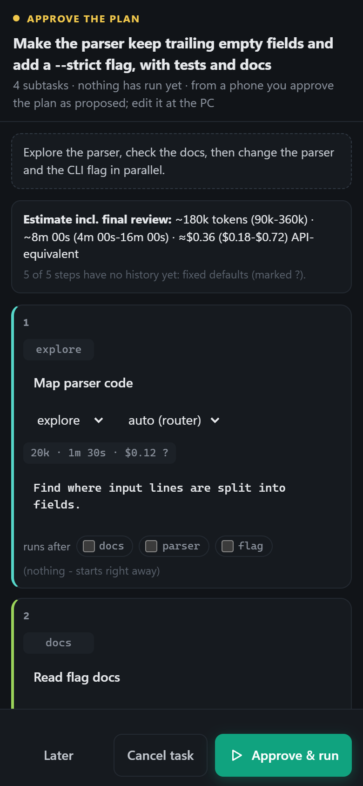
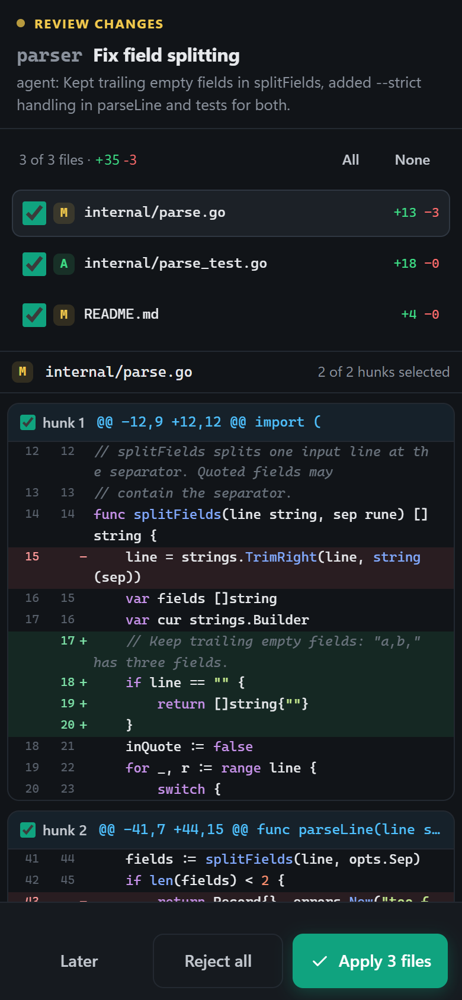

# Unattended runs: the morning summary and approving from your phone

Queued tasks, scheduled runs (`--at`, `--in`, `--when-reset`) and task files
(`rw run --file`) run without you. This page covers two things that help
with that: a summary of what ran while you were away, and answering
approvals from your phone.

## The morning summary

```
rw morning                    # the unattended tasks of the last 12 hours
rw morning --since 18:00      # since 18:00 (the last one); or 2d, 36h
rw morning --here --all       # this project only, also the tasks you watched
rw morning --json             # for scripts
```

```
Since Tue 18:00: 2 of 4 task(s) done, 1 failed, 1 interrupted - 3 thing(s) need you

Needs you:
  - failed: add --json to rw history  →  rw report 20261007-010012-ab12-task-1
  - interrupted: refactor the budget check  →  rw resume 20261007-020044-cd34-task-1
  - a merge conflict was kept on branch rw/kept/... (merge both)  →  git diff HEAD...rw/kept/...

Tasks:
  Tue 23:00  done        repo: fix the flaky parser test · 20m0s · undo: rw undo 20261006-230001-ef56-task-1
  01:00      failed      repo: add --json to rw history · 30m0s
      checks failed: go test
  ...

Used: codex 50k · claude 120k fresh tokens · ≈$1.50 API-equivalent
Limits hit: claude at 01:20 (until 03:00)
```

It lists the following:

- Every unattended task whose run overlaps the time span: its result, its
  duration and the `rw undo` key of each finished task.
- **Needs you**, with the command for each item:
  - a failed task (`rw report`);
  - an interrupted task (`rw resume`);
  - a merge conflict kept on a branch;
  - half-done edits saved on a branch.
- The fresh tokens and API-equivalent cost of those tasks.
- The usage limits the providers hit in that time.

The summary covers every project on this machine. A task counts as
unattended when it ran without anyone to ask:

- queued in the TUI or `rw web`;
- scheduled;
- from a task file, `--issues` or `--fill`.

Tasks recorded before this version are not marked, so `--all` shows them.

### Every morning, on your phone

Set a time of day in your config:

```yaml
notify:
  morning: "07:30"
  webhooks:
    - url: https://ntfy.sh/rw-change-me-to-something-random
```

At 07:30, the summary of the unattended tasks since 07:30 the day before
goes to your webhooks (event `summary`) and appears as a desktop
notification. It is posted by an `rw web`, a TUI or an unattended `rw run`
that is running at that time. If several are running, one posts it. A night
without unattended tasks sends nothing.

If no rw runs at that time, `rw morning --schedule --at 07:30` prints a
Windows Task Scheduler or cron line. It runs `rw morning --send` every day.
Nothing is installed: you copy the command.

In `rw web`, the **Overnight** panel shows the same summary, with a choice
of time span.

## Approving from your phone

A queued or scheduled task can wait for you at plan approval or change
review (`orchestrator.approve_plan`, `orchestrator.review_changes`). It can
also wait for a budget or conflict question. To answer those away from the
PC, run:

```
rw web --phone
```

`rw web` then also listens on this machine's Tailscale address, or, without
Tailscale, on its private network address. It prints a QR code; scan it
with the phone's camera. The page opens on the phone, already signed in. It
stays signed in until `rw web` stops, so you can lock the phone and come back
later. Press `p` and Enter in `rw web`'s terminal for a new code. The
desktop page shows one too, under **Phone**.

With a webhook set, a task that waits for you posts a `waiting` message. It
carries the page's address on the phone, so you can tap it and answer.

The page fits a phone screen:

- The header wraps.
- The agents sit above the activity log.
- Panels and approvals take the whole screen, with large buttons at the
  bottom.

| | |
|---|---|
|  |  |

### What a phone can do

A phone can look at everything that is running. It can do the following:

- approve or reject a plan;
- apply or reject an agent's changes, also file by file or hunk by hunk;
- answer budget and conflict questions;
- pause, cancel, stop an agent, and remove queued tasks.

A phone cannot give the agents new instructions:

- start or schedule tasks;
- edit a plan (approving from a phone approves the plan as proposed);
- send review feedback;
- resume tasks;
- change settings or routes (verify commands run in a shell);
- pair another device.

The server enforces this, not only the page.

### Security

- The phone listener only takes a Tailscale address (100.64.0.0/10,
  fd7a:115c:a1e0::/48) or a private one (10/8, 172.16/12, 192.168/16, IPv6
  ULA). It never takes a public one. `--phone-addr <ip>` picks one
  yourself.
- The pairing link works once, within 2 minutes, like the desktop link.
- A desktop session is refused on the phone address.
- Requests must name the phone address as their Host. This defeats DNS
  rebinding, as on 127.0.0.1.
- **Tailscale** encrypts the way between the phone and the PC.
  **On a local network the page is plain HTTP**: someone who can read the
  Wi-Fi traffic could read the session. Even then, all they could do is say
  yes or no to work you queued yourself, or cancel it. Use the LAN only on a
  network you trust.
- On Windows, the firewall may ask the first time. Allow rw on private
  networks.
